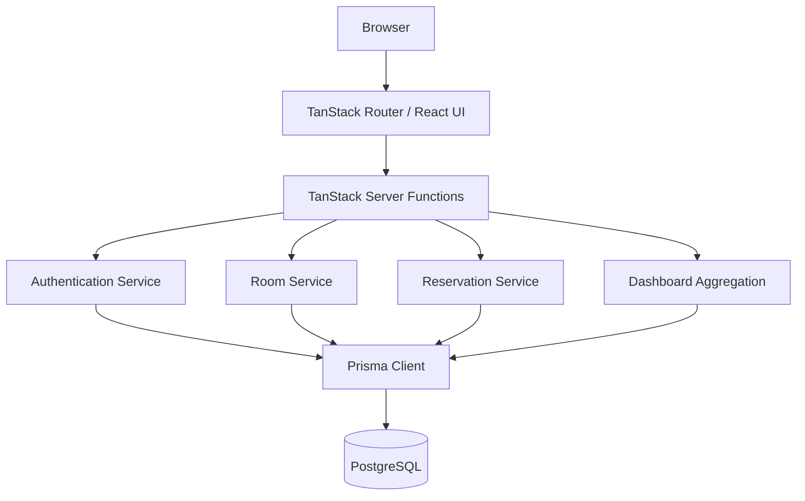
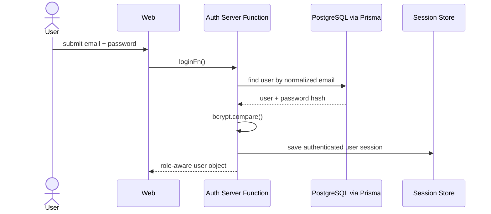

# Architecture

## Overview

Go Reserve is a full-stack room-reservation application built with TanStack Start and server functions, backed by Prisma and PostgreSQL.

## Domain model

The persisted model centers on three entities:

- **User** — identity, role and optional student identifier;
- **Room** — capacity, facilities, location and availability status;
- **Reservation** — links a user to a room with start/end times, purpose and workflow status.

The schema uses explicit enums for user role, room status and reservation status. Reservation indexes support lookups by user, room and time range.

## Authentication flow

Passwords are hashed with bcrypt during registration. Authentication responses use the same generic error message for an unknown email and an invalid password, reducing direct account enumeration through login errors.

## Reservation flow

Before a new reservation is stored, the service queries active `PENDING` and `APPROVED` reservations for the same room and checks for time overlap. If a conflict is found, the request is rejected; otherwise a new `PENDING` reservation is created.

The admin workflow can transition reservations to `APPROVED`, `REJECTED`, or `CANCELLED`.

## Dashboard flow

The dashboard service aggregates counts in parallel, including total rooms, available rooms, total users, pending/approved reservations and approved reservations for the current day. A separate query returns recent reservation activity.

## Delivery architecture

```mermaid
flowchart LR
    SCM[Git Repository] --> J[Jenkins]
    J --> B[Docker Build]
    B --> TAR[docker save + gzip]
    TAR --> SCP[SCP over SSH]
    SCP --> VM[Deployment VM]
    VM --> LOAD[docker load]
    LOAD --> RUN[Run Application Container]
    RUN --> DBSETUP[Prisma DB Setup / Seed]
    DBSETUP --> VERIFY[HTTP Verification]
```

The public portfolio replaces original internal host details with placeholders. Full historical context remains in the original team repository linked in `SOURCE_EVIDENCE.md`.