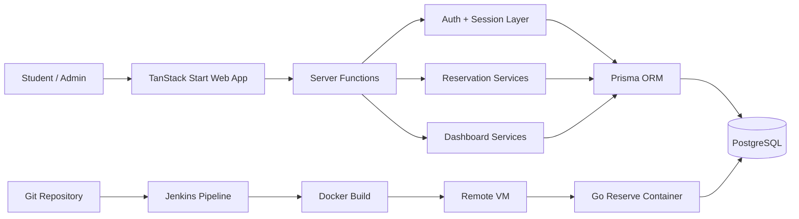

# Go Reserve DevSecOps Platform

[](./package.json)
[](./package.json)
[](./prisma/schema.prisma)
[](./prisma/schema.prisma)
[](./Dockerfile)
[](./Jenkinsfile.example)

A recruiter-facing, sanitized portfolio mirror of **Go Reserve**, a collaborative room-reservation platform developed as part of the `dso-1` DevSecOps group project.

The original team work combined application engineering with deployment automation: **TanStack Start + React + TypeScript**, **Prisma + PostgreSQL**, role-aware authentication, room and reservation workflows, Docker packaging, and a Jenkins-based delivery pipeline to a remote VM.

> **Attribution:** this was a collaborative team project. This personal repository does not claim sole authorship of the original application. Original Git history remains linked in [SOURCE_EVIDENCE.md](./SOURCE_EVIDENCE.md). Some work was also performed from shared development machines, so Git author metadata alone is not treated as a complete record of team contribution.

## What a reviewer can inspect quickly

| Area | Evidence |
|---|---|
| System design | [ARCHITECTURE.md](./ARCHITECTURE.md) |
| CI/CD flow | [CI_CD.md](./CI_CD.md) |
| Data model | [prisma/schema.prisma](./prisma/schema.prisma) |
| Authentication | [src/features/auth/api/auth.server.ts](./src/features/auth/api/auth.server.ts) |
| Reservation logic | [src/features/reservations/api/reservations.api.ts](./src/features/reservations/api/reservations.api.ts) |
| Dashboard aggregation | [src/features/dashboard/api/dashboard.api.ts](./src/features/dashboard/api/dashboard.api.ts) |
| Container setup | [Dockerfile](./Dockerfile) and [docker-compose.yml](./docker-compose.yml) |
| Sanitized Jenkins pipeline | [Jenkinsfile.example](./Jenkinsfile.example) |
| Team attribution | [TEAM_ATTRIBUTION.md](./TEAM_ATTRIBUTION.md) |
| Original repositories | [SOURCE_EVIDENCE.md](./SOURCE_EVIDENCE.md) |
| Portfolio-ready summary | [PORTFOLIO.md](./PORTFOLIO.md) |

## Product scope

Go Reserve provides a reservation workflow for university rooms with separate user experiences for **Admin** and **Mahasiswa/Student** roles.

Core capabilities represented in the original project include:

- user registration and login;
- password hashing with `bcryptjs`;
- session-based authentication;
- admin and student dashboard experiences;
- room management and room availability status;
- reservation creation and lifecycle management;
- conflict checking for overlapping bookings;
- user management;
- dashboard statistics and recent-activity aggregation;
- Prisma-backed PostgreSQL persistence;
- Docker-based local/runtime packaging;
- Jenkins deployment to a remote VM with database initialization and HTTP verification.

## High-level architecture



## Representative reservation rule

The reservation service checks for existing `PENDING` or `APPROVED` bookings that overlap a requested time range before creating a new reservation. This is a useful example of business logic living on the server side rather than relying only on client-side validation.

See [reservations.api.ts](./src/features/reservations/api/reservations.api.ts).

## CI/CD workflow

The original Jenkins pipeline implemented the following flow:

```text
checkout
  -> docker build
  -> docker save + gzip
  -> SCP image to deployment VM
  -> docker load
  -> replace running container
  -> Prisma database setup / seed
  -> HTTP verification
```

The public copy in this repository removes the original private VM address and environment-specific deployment values.

## Repository structure

```text
.
├── README.md
├── ARCHITECTURE.md
├── CI_CD.md
├── TEAM_ATTRIBUTION.md
├── SOURCE_EVIDENCE.md
├── PORTFOLIO.md
├── SECURITY.md
├── Jenkinsfile.example
├── Dockerfile
├── docker-compose.yml
├── package.json
├── prisma/
│   └── schema.prisma
└── src/features/
    ├── auth/api/auth.server.ts
    ├── dashboard/api/dashboard.api.ts
    └── reservations/api/reservations.api.ts
```

## Why this is a curated mirror

The original repositories contain a much larger application tree, generated Prisma artifacts, lockfiles, development tooling, and environment-specific deployment history. For portfolio review, this repository keeps representative production-relevant source and architecture while linking back to the original collaborative repositories for full history.

## Security and privacy

No private deployment IP, SSH credential, database password, session secret, or production `.env` value is intentionally stored here. See [SECURITY.md](./SECURITY.md).

---

**Portfolio owner:** [Syifani Adillah Salsabila](https://github.com/syifaniads)  
**Project type:** Collaborative Full-Stack / DevSecOps Engineering Project  
**Context:** Universitas Brawijaya — 2026